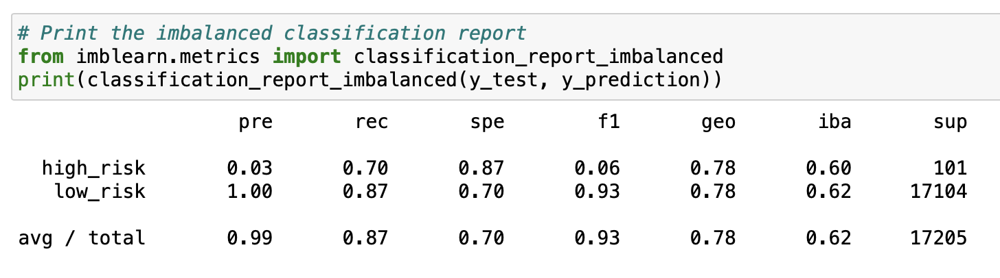

# Credit Risk Analysis

## Overview of the analysis
The purpose of this analysis was to use different machine learning models to predict credit card risk. This challenge was created to determine if any of these machine learning models is useful for determining credit card risk.

## Results
### Naive Random Oversampling

### SMOTE Oversampling

### Undersampling

### Combination (Over and Under) Sampling

### Balanced Random Forest Classifier

### Easy Ensemble AdaBoost Classifier

## Summary: Summarize the results of the machine learning models, and include a recommendation on the model to use, if any. If you do not recommend any of the models, justify your reasoning.
